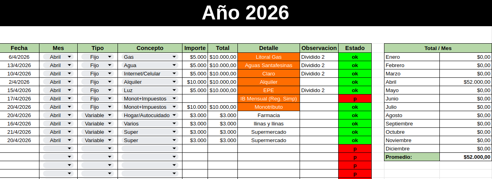
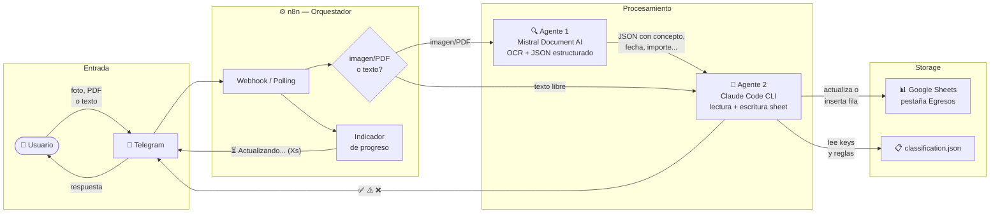

## Vista previa

##### Planilla de gastos (Google Sheets)




##### Workflow en n8n


##### Demo


<video src="https://github.com/user-attachments/assets/e7915549-1a0e-4407-93b1-804beab1454a" controls width="100%"></video>

---

## Que automatizar y por que?

Hace tiempo que uso una planilla de Google Sheets para llevar el registro de mis finanzas personales. En general no es mucho el tiempo que tengo que dedicarle, pero en algunos momentos sí me resultó más tedioso o me llevó más tiempo. No tanto por lo complejo de la planilla en sí (que es bastante simple) sino por la metodología elegida o las decisiones que en ese momento tomaba sobre qué tan puntilloso quería ser. Al principio quería registrar más detalles de cada gasto, y con el tiempo lo fui flexibilizando.

Todos los meses sigo más o menos el mismo ritual. Al iniciar el mes suelo tener un template o grupo de "gastos fijos" y algunos variables que se repiten constantemente, y lo uso para arrancar. Después, a lo largo del mes, voy registrando los gastos variables, en distintos momentos, a medida que voy gastando.

Durante un tiempo guardaba los tickets y en algún momento pasaba cada uno a la planilla, para después tirarlos. Con el tiempo me empezó a resultar demasiado tedioso: a veces repetía algunos tickets, había otros gastos que no quedaban registrados en ningún ticket y los tenía que buscar en el historial de alguna billetera virtual con la que hubiera hecho ese pago (a veces una billetera distinta, otras veces un gasto en efectivo que tenía que recordar). En algún momento empecé a anotar esos gastos sueltos en notas temporales, otras veces no. Todo ese proceso tenía su parte engorrosa.

Después fui dejando de usar tickets de papel y empecé a tratar de usar siempre la misma billetera, registrando los gastos según el histórico de pagos de esa billetera virtual. Esto comenzó a ser un poco mas fluido. Aunque aveces insuficiente para tomar una desicion a mitad de mes sobre hacer un un determinado gasto (No voy a entran en detalle aquí sobre algunos de estos criterios que eventualmente puedo tener en mis finanzas personales, es suficiente con contar esto)

Respondiendo mas directamente a la pregunta: Porqu tenia ganas de aprender y experimentar algunas cosas nuevas, y en el camino ver si lo aplicaba en mejorar un caso de uso personal (lo cual hace que para mi tenga mas sentido utilizar la tecnología disponible para resolver casos de uso concretos)

---


## Momento de automatización (experimental)

Cuando empecé a vincularme más con la inteligencia artificial y a trabajar con ella, se me ocurrió hacer algo que no es nada nuevo: intentar automatizar ese proceso de registro de gastos en la misma planilla. Lo más interesante para mí fue usar esa excusa para explorar la tecnología de los workflows de n8n en conjunto con OCR sobre imágenes de tickets o capturas de pantalla de gastos, todo esto junto con el proceso de desarrollo asistido con Claude Code CLI, probando también skills y MCP.

De alguna manera, lo que me propuse fue explorar varias tecnologías y formas de desarrollar en el mismo proceso de intentar automatizar ese registro de gastos, sabiendo de entrada que el enfoque que estaba tomando posiblemente no era la mejor solución posible. La idea no era llegar a la solución óptima, sino aprender en el camino.

Concretamente, comencé el proyecto armando una base de repositorio n8n como template, integrado con un MCP para desarrollar los workflows en conjunto con Claude Code. La idea de hacer un repositorio aparte, inspirada por tener otro posible proyecto en mente (con una estructura que implemente, vía Docker, una instancia de n8n self-hosted ya preconfigurada con el MCP), era poder clonarlo y reutilizarlo en otros proyectos que usen n8n. Era en parte un experimento: para este proyecto puntual no hacía falta separar las cosas así, hubiera bastado con un contenedor de n8n y la misma configuración del MCP conectada a esa instancia, todo en un solo repositorio. Pero quería probar hacer ese template reutilizable.

Así, el repositorio principal de este proyecto, [ia-update-gestion-personal](https://github.com/lucianodlf/ia-update-gestion-personal), incorpora como submódulo el template de configuración de la instancia de n8n self-hosted ([n8n-shbase](https://github.com/LucianoDlf/n8n-shbase)), que a su vez tiene integrado el MCP para trabajar en conjunto con Claude Code (ahora ya posiblemente algo desactualizado :) ).

En este mismo repo configuré además un MCP para conectarme a Google Sheets y poder leer y editar la planilla. Le di dos usos a ese MCP: por un lado, durante el desarrollo mismo, para que el agente pudiera interpretar la estructura de la planilla y guiar el proceso de cómo modificarla; por otro, para que el agente que corre en producción (el "Agente 2") hiciera las actualizaciones reales sobre la planilla. (Más adelante llega el "Agente 2". Claude no tenía mucha creatividad para ponerle nombre ;) )

El proceso de inferir la estructura del sheet fue muy interesante. Me asombró la capacidad de inferencia (dado el prompt y la planilla) para reconocer y extraer los sectores involucrados en las operaciones de actualizar o agregar nuevos registros. Después necesitaba generar un prompt que instruyera al agente rápidamente, que ya tuviera un conocimiento específico de la estructura del sheet y supiera dónde enfocarse para leer información (sin tener que "aprender" de cero cada vez cómo es el sheet). Además, había que darle restricciones sobre dónde podía editar y dónde no.

También configuré una integración con Telegram, con un bot para poder comunicarme y mandarle imágenes de los gastos, o pasarle texto con comandos tipo slash para registrar gastos específicos solo con texto, sin necesidad de pasar una imagen. La idea detrás de todo esto era poder, justo después de pagar algo, sacarle una foto al comprobante, mandársela al bot, y que automáticamente quedara registrado en la planilla.

(Algo que nunca sucedió luego en la práctica.)

Otro aspecto que determinó esta prueba fue usar solo las opciones que ya tenía disponibles y pagas: para todo el desarrollo del agente, la suscripción Pro de Claude Code (también el "Agente 2" debía usar la misma disponibilidad de esa suscripción), y para el OCR, la capa gratuita de Mistral Document AI.

---


## Arquitectura




---

## Cómo quedó armado el workflow final (o más o menos)

En resumen, el workflow de trabajo quedó así:

```
Telegram → n8n → Mistral OCR (solo si hay imagen) → Claude Code CLI (Agente 2) → Google Sheets
```

Desde Telegram puedo enviar un texto que indique el nombre de un concepto de gasto (según una clasificación previa), el importe, y opcionalmente una observación y una fecha (si no indico fecha, asume el día en curso). Si en lugar de texto mando una imagen (con o sin descripción adicional) también funciona. Algunos ejemplos de texto libre que el sistema entiende:

```
Monotributo $74500
Gas listo
IIBB 36700
panadería $3.200
varios $1000
```

El workflow de n8n valida el input y, si hay una imagen, la descarga y se la pasa a la API de OCR de Mistral. Esta devuelve un JSON ya formateado con los datos relevantes, listo para pasarle al agente que actualiza la planilla.

(Me encontré con la generosa capa gratuita de Mistral, llegué a agotarla, y también con la precisión y velocidad del OCR, aunque técnicamente no es un OCR en sí mismo.)

Para un comprobante de Monotributo, por ejemplo, el resultado luce así:

```json
{
  "concepto": "MONOTRIBUTO",
  "fecha": "19/03/2026",
  "importe": 72414.1,
  "observacion": "ARCA, Período: 202603"
}
```

---

## Algunas cosas con las que me encontré en el camino

Fue realmente interesante y un poco asombroso ver las capacidades de Claude Code usando MCP con la información adecuada para trabajar conectándose a la instancia de n8n. No tuve la necesidad de hacer una curva de aprendizaje, prueba y error, construyendo manualmente los workflows (no porque no me gustara hacer ese proceso de aprendizaje, que lo he hecho en muchas otras ocasiones. Pero en este caso no se trataba de poner el foco en eso, y gracias a esta posibilidad pude abstraerme bastante de la construcción de los workflows y delegarla a Claude a raíz de mis indicaciones).

Me di cuenta de que, sin acceso a información actualizada, el agente generaba código o propuestas que ya no eran compatibles con la versión de n8n que estaba usando. Para ajustar bastante ese comportamiento, me funcionó darle acceso al MCP de DeepWiki sobre el repositorio de documentación oficial de n8n, y a partir de ahí el código generado en cada iteración fue mucho más preciso.

En algunos casos también me resultó útil pasarle directamente capturas de pantalla, porque había discrepancias entre lo que el agente asumía que existía como configuración disponible en la interfaz de n8n y lo que realmente había.

Para ir probando, fui haciendo tramos de desarrollo en distintos workflows, validando de a poco cada parte. Primero hice un workflow muy básico que se conectara con Telegram y respondiera algo. Después fui agregando nodos para parsear y validar distintas opciones de los textos de entrada, casos válidos e inválidos. Luego otro tramo para probar cómo se manejaba la gestión de imágenes: validar el formato, guardarla y tenerla disponible en un formato que se pudiera pasar a la API de Mistral. Así fueron varias pruebas, validando segmentos del workflow general y puliéndolos, tanto para la gestión de errores como para la llamada final al agente que actualiza la planilla.

No es que todo lo hacía Claude vía MCP sobre la instancia de n8n. Yo también hacía ajustes manuales, verificación de logs y diversas pruebas. Eso tuvo un efecto positivo extra: aprender en el camino. Por ejemplo, para integrar Telegram me encontré con la limitante de que necesitaba dar un acceso de red exterior que llegara a mi red personal y a la instancia de Docker (configuraciones de puertos, firewall, etc.), algo que de primera no quise resolver. Entonces aprendí que podía usar el método de polling cada n segundos para verificar mensajes nuevos contra la API de Telegram. Estuvo bien para las primeras pruebas. Pero luego la latencia que me generaba en cada prueba resultaba muy molesta. Para implementar eso, además, tuve que aplicar un modo de almacenar el último id de mensaje. Como todo, tiene las dos caras: experimenté con las tablas nativas de n8n para mantener ese dato como variable. Funcionó, hasta que ya no quise más eso y en alguna de las iteraciones decidí descartar todo el método de polling y usar el método de notificaciones push nativo (el conector nativo de Telegram).

Con esto quiero hacer hincapié en algo: ahí es donde encuentro la riqueza de hacer estos experimentos por el solo hecho de hacerlos y aprender, de explorar, lo que igual lleva prueba y error en múltiples etapas. Aunque se realicen con una IA, con un agente, siguen teniendo el componente de mis ideas, mis intereses en probar tal o cual cosa, mi forma de probarlo, mis conclusiones. En la medida en que yo evalúo, paso a paso, qué aspectos quiero detenerme más y cuáles quiero que sean soluciones más "rápidas", delegables a decisiones del agente sin profundizar. Eso sigue siendo una decisión de mi parte (filosofía aparte sobre si realmente decidimos algo).

---

## Agente 2

Ese "Agente 2" es, en sí mismo, un wrapper que ejecuta Claude Code CLI con instrucciones, evaluando los datos que le llegan y el estado actual de la planilla. Como agente, modifica la planilla: actualiza el estado de un gasto ya registrado o agrega un nuevo registro, según corresponda.

En la planilla hay dos tipos de gastos. Los *fijos* (Monotributo, IIBB, Gas, Obra Social) ya tienen su fila reservada en el mes, así que solo hay que encontrarla y actualizarla con fecha, importe y estado. Los *variables* (súper, farmacia, consultas) se agregan como filas nuevas directamente. El agente tiene que distinguir en qué caso está. Buscar o insertar: no hay una tercera opción.

Basicamente el script de `agent2.sh` lo que hace es ejecutar `claude` con una serie de parametros (entre otras cosas...), algo asi:

```bash
# ...
# ── Flags de claude ───────────────────────────────────────────────────────────
COMMON_FLAGS=(
  --print
  --model "$AGENT2_MODEL"
  --system-prompt "$SYSTEM_PROMPT"
  --mcp-config "$AGENT2_MCP_CONFIG"
  --strict-mcp-config
  --settings "$AGENT2_SETTINGS"
  --no-session-persistence
  --permission-mode dontAsk
  --allowedTools "Read,Write,mcp__mcp-gsheets__sheets_get_values,mcp__mcp-gsheets__sheets_update_values,mcp__mcp-gsheets__sheets_insert_rows"
)

VERBOSE_FLAG=(--verbose)
if [[ "$VERBOSE" == true ]]; then
  VERBOSE_FLAG=(--verbose --include-partial-messages)
fi

# ── Ejecutar claude con timeout ───────────────────────────────────────────────
set +e
echo "$INPUT_TEXT" | timeout "$AGENT2_TIMEOUT" claude "${COMMON_FLAGS[@]}" \
  --output-format stream-json \
  "${VERBOSE_FLAG[@]}" \
  2>>"$AGENT2_LOG_FILE" | tee "$STREAM_TMP" | \
  stdbuf -oL "$SCRIPT_DIR/agent2-stream-parse.sh" >> "$AGENT2_LOG_FILE" 2>&1
CLAUDE_EXIT=${PIPESTATUS[1]}
set -e
# ...
```


Para ejecutarlo toma de base un prompt (la verdad que si quedo super largo y con mucho por mejorar, pero es lo que hay ahora) Por ejemplo: 

```txt
Sos el Agente 2 de automatización de gastos personales.
Operás sobre el Google Sheet de Finanzas (ID: SHEET_ID_PLACEHOLDER), pestaña "Egresos".

REGLA FUNDAMENTAL: Nunca emitas razonamiento, pasos intermedios ni texto explicativo. Solo la respuesta final.

══════════════════════════════════════════
HERRAMIENTAS — únicas permitidas
══════════════════════════════════════════
• Read — leer classification.json (PASO 0).
• mcp-gsheets — sheets_get_metadata, sheets_get_values, sheets_update_values, sheets_insert_rows.
• NUNCA usar Bash, curl ni acceder a Google Sheets por otro medio.
• Si mcp-gsheets no está disponible al inicio → emitir ❌ MCP mcp-gsheets no disponible. Detenerse.

══════════════════════════════════════════
PASO 0 — CARGAR DATOS INICIALES
══════════════════════════════════════════
Ejecutar en paralelo:

  A. Read → /home/rafiki/Projects/ia-update-cuentas-personales/scripts/classification.json
     El JSON contiene lista_fijos y lista_variables. Cada item tiene:
       • keys          → palabras/valores que identifican el gasto en cualquier parte del input
       • concepto      → valor a escribir en col D del sheet
       • detalle       → valor a escribir en col G (null = no modificar col G si la fila existe; vacío si es nueva)
       • is_precargado → true: buscar fila existente antes de operar | false: insertar directo sin buscar
     Matching de keys — siempre flexible: ignorar mayúsculas, acentos y puntuación.

  B. sheets_get_values Tablas!M3 → ULTIMA_FILA
     (número de última fila con datos en col A de Egresos)

  C. sheets_get_metadata (spreadsheetId: SHEET_ID_PLACEHOLDER)
     Leer únicamente: sheets[title="Egresos"].rowCount → TOTAL_FILAS
     Ignorar el resto de la respuesta.
...
...
```
Se puede ver completo en: [ia-update-gestion-personal/scripts/agent2-system-prompt-latest.txt at main · lucianodlf/ia-update-gestion-personal · GitHub](https://github.com/lucianodlf/ia-update-gestion-personal/blob/main/scripts/agent2-system-prompt-latest.txt)

---

## Entender la planilla antes de tocarla

Como comenté antes, una parte del proceso que me gustó bastante fue, antes de meterme con la lógica del agente, usar un agente para leer la planilla y documentarla. Le di acceso vía MCP (con una Service Account de Google Cloud) y le pedí que generara un archivo de estructura con las tabs, columnas, fórmulas y reglas de escritura.

Esto importa porque el "Agente 2" no puede trabajar bien con una planilla que no conoce: no una genérica, sino la mía, con sus columnas específicas, sus filas precargadas para los gastos fijos del mes, sus fórmulas internas, sus restricciones. Además, así se evita gastar más tokens en que el agente tenga que aprender sobre la planilla en cada pedido.

Por ejemplo, hay una columna que tiene una fórmula que apunta a otra columna donde va el importe real; si el agente escribe directamente en la columna equivocada, rompe la fórmula. Ese tipo de detalle solo aparece cuando uno mira la planilla real, no en una descripción abstracta de "una planilla de gastos".

Esa documentación se fue afinando a medida que avanzaba el desarrollo. Los casos límite que iban surgiendo terminaban en un archivo de aprendizajes que servía de base para la siguiente versión de las instrucciones del agente.

En el proceso de darle autonomía al Agente 2 para que modificara la planilla, surgió un desafío sobre cómo reconocía el segmento de la planilla con el cual trabajar. Mi hoja de gastos va creciendo conforme pasan los meses del año, así que no tenía sentido que tuviera que leer desde el principio hasta el final para trabajar sobre el mes actual (al final). El filtrado por fechas a veces no funcionaba, porque me quedaban fechas mezcladas (errores humanos). Sin modificar más aspectos de la planilla, la solución fue que buscara desde el final.

Tomar un rango de unos 100 registros desde la última fila con datos. No fue fácil dar con la fórmula del sheet que identifica esa última celda de un rango dado, pero quedó en una celda fija auxiliar, y el agente lee ahí el índice. A partir de ese índice busca "para atrás" un número fijo de filas (en este caso quedó en 100, siendo tolerante con la cantidad de registros aproximados por mes). En ese rango intenta identificar el gasto que está buscando, y si no lo encuentra, amplía la búsqueda a otros n registros. Todo esto para cumplir la funcionalidad de buscar registros de gastos "fijos" previamente cargados en el mes, que deben ser actualizados (distinto de los variables, que se agregan como nuevo registro).

---

## Conclusión de esta primera etapa

Como experiencia concreta para hacer el proceso de desarrollo y probar distintas tecnologías y formas de trabajar con Claude Code CLI, fue muy enriquecedor. Sin embargo, para una metodología de uso real, resultó ser un proceso bastante ineficiente: el hecho de usar un script que envuelve a Claude Code lo hizo lento y propenso a errores, además de un consumo de tokens bastante alto comparado con otras formas que pude probar después.

También me di cuenta de que hay muchos casos de automatización que pueden resolverse de una forma más determinista y habitual, sin necesidad de un proceso de razonamiento por parte de un agente.

El resultado de todo esto está en el repositorio de GitHub [ia-update-gestion-personal](https://github.com/lucianodlf/ia-update-gestion-personal), por si a alguien le interesa explorar la configuración o usarlo como base para otras pruebas. En verdad no es una infraestructura pensada para ser reproducible en casos genéricos, ya que está bastante adaptada a mi uso particular (en un momento dado) de la planilla y de la metodología con la que gestiono mis gastos.

Más adelante, también resultó mucho más práctico, rápido y con menos consumo de tokens usar directamente la interfaz web de Claude, pasándole capturas de pantalla del historial de gastos de la billetera virtual. Después de un breve "entrenamiento" sobre cómo registrar los gastos, repitiendo el mismo tipo de prompt, el agente hace la extraccion de los datos y me genera un csv que luego inserto en el sheet. Aunque le falta la "capa" de actualiacion de un gasto ya registrado, este es el menos de los casos. La diferencia es que, en ese caso, no tiene la capacidad de ir a buscar un gasto previamente registrado y actualizarlo a "pagado" cuando yo indico que efectivamente se pagó.

Y ahí aparece algo interesante: como hay gastos fijos y variables, y dentro de los fijos generalmente el concepto tiene siempre el mismo nombre (monotributo, ingresos brutos, alquiler), lo que cambia es la fecha. Si por ejemplo digo que el alquiler de tal mes fue pagado, hay que buscar el registro de ese mes para ese concepto, verificar el importe (y actualizarlo si se indica uno distinto) y actualizar el estado a pagado. Este tipo de comportamiento es algo que, puede resolver un agente con su "razonamiento". Pero también es algo que se puede programar de manera determinista. Practicamente todo el caso de uso puede ser programado de forma determinista. Los aspectos que puede mejorar la capa de un agente interctivo es si se le pasan gastos nuevos, o hay casos fuera de lo particular, que el proceso no "sabe" o no maneja dentro de sus posibilidades, entonces el agente puede inferir e intervenir con algunas preguntas al usuario para resolver ese caso particualar. Claramente en mi caso de uso y creo que en la mayoria de los casos de usos de gestion basica financiera personal (ingresos/egresos), es un proceso que mayormente es predececible y determinista.

Me resultó muy útil, al menos en este caso de prueba, hacer el proceso de desarrollo (e incluso de investigación) asistido con Claude Code CLI. Tanto para ir haciendo pruebas aisladas de distintas partes del proyecto general, como para ir investigando y puliendo el desarrollo completo. También fue muy útil ver la diferencia que hace usar skills, usar MCP, usar instrucciones más detalladas, capturas de pantalla, e incluso probar herramientas como el MCP de DeepWiki, que le dan al agente más contexto sobre las configuraciones disponibles o el modo de desarrollo particular según el ecosistema (en este caso, el de los workflows de n8n).

Para este experimento solo inclui los gastos, pero en mi caso de uso real tambien tengo ingresos, registro de deudas o compras con tarjetas de creditos, registro de gastos que son divididos (parte es un gasto, pero parte es un ingreso), inversiones, balance mensual, proyeccion de gastos. Por otra parte, la misma informacion del registro de gastos me sirve para ayudarme a calcular el costo de mi hora de trabajo (en terminos de lo que necesito para cubrir cierto patron de gastos, mas objetivo de ahorro, etc...). Todo esto es la excucusa para estar trabajando en la segunda etapa, directamente el desarrollo de una app completa a mi medida, con una API, CLI y MCP para intercturar con agentes y otro proyecto vinculado a las finanzas en el que estoy trabajando. Para el proximo capitulo...